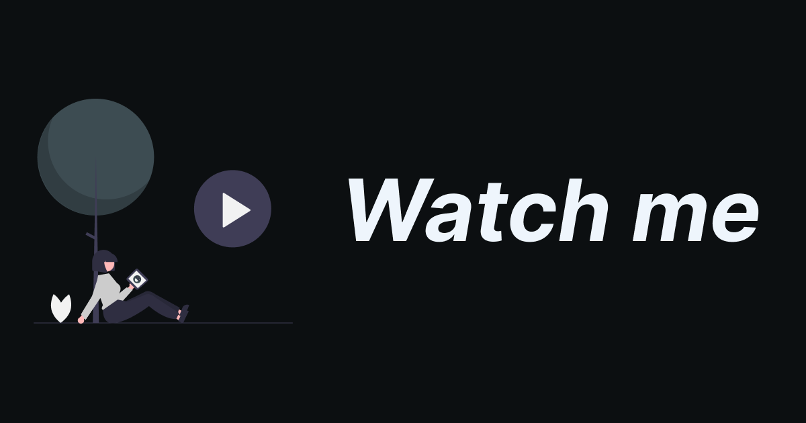

# WatchMe



WatchMe is a live streaming platform that allows users to stream their livestreams to the platform.

## Frontend
The frontend is written in React and uses the package [Next.js](https://nextjs.org/) for the frontend framework.

### Setup

To set up the frontend, follow these steps:

1. Clone the repository.
 ```bash
 git clone https://github.com/Waxer59/WatchMe.git
 ```
2. Change the working directory to the frontend directory.
 ```bash
 cd WatchMe/frontend
 ```
3. Install the dependencies.
 ```bash
 pnpm install
 ```
4. Run the development server.
 ```bash
 pnpm dev
 ```
* The `NEXT_PUBLIC_ENVIRONMENT` is the environment the frontend is running in, either `DEV` or `PROD`.
* The `NEXT_PUBLIC_BACKEND_URL` is the URL of the backend e.g. `http://localhost:3000/api`.

### Dependencies
The frontend uses the following dependencies:

- [Next.js](https://nextjs.org/)
- [Zustand](https://github.com/pmndrs/zustand)
- [Tailwind CSS](https://tailwindcss.com/)
- [Chakra UI](https://chakra-ui.com/)
- [Lucide](https://lucide.dev/)

## Backend
The backend is written in Go and uses the package [fiber](https://github.com/gofiber/fiber) for the backend framework.

### Setup

To set up the backend, follow these steps:

1. Clone the repository.
 ```bash
 git clone https://github.com/Waxer59/WatchMe.git
 ```
2. Change the working directory to the backend directory.
 ```bash
 cd WatchMe/backend
 ```
3. Install the dependencies.
 ```bash
 go mod download
 ```
4. Clone `.template.env` to `.env` and fill in the required environment variables.
 ```bash
 cp .template.env .env
 ```
* The `OAUTH_GITHUB_REDIRECT_URL`, `OAUTH_GITHUB_CLIENT_ID`, and `OAUTH_GITHUB_CLIENT_SECRET` are the OAuth2 credentials for your Github application.
* The `DB_PASSWORD`, `DB_PORT`, `DB_HOST`, `DB_NAME`, and `DB_USERNAME` are the database connection details.
* The `COOKIE_ENCRYPTION_KEY` is a random string used to encrypt the cookies.
* The `COOKIE_DOMAIN` is the domain used for the cookies.
* The `JWT_SECRET_KEY` is a random string used to sign the JWT tokens.
* The `PORT` is the port the backend will listen on.
* The `FRONTEND_URL` is the URL of the frontend.
* The `MUX_TOKEN_ID` and `MUX_SECRET_KEY` are the Mux credentials, this services is being used for live streaming
* The `MUX_WEBHOOK_SECRET` is the secret key used to sign the Mux webhooks.
* `REDIS_PORT`, `REDIS_HOST`, `REDIS_PASSWORD`, and `REDIS_USERNAME` are the Redis connection details.
* The `ENVIRONMENT` is the environment the backend is running in, either `DEV` or `PROD`.

> [!TIP]
> To generate a random string, you can use the command `openssl rand -base64 32`.
1. Run local database.
 ```bash
 docker-compose up -d
 ```
1. Run the backend.
 ```bash
 go run main.go
 
 # or for hot reloading

 air
 ```

### Dependencies
The backend uses the following dependencies:

- [fiber](https://github.com/gofiber/fiber)
- [fiber/swagger](https://github.com/gofiber/swagger)
- [fiber/encryptcookie](https://github.com/gofiber/encryptcookie)
- [fiber/helmet](https://github.com/gofiber/helmet)
- [fiber/cors](https://github.com/gofiber/cors)
- [fiber/logger](https://github.com/gofiber/logger)
- [gorm](https://github.com/go-gorm/gorm)
- [gorm/postgres](https://github.com/go-gorm/postgres)
- [air](https://github.com/air-verse/air)
- [Mux](https://www.mux.com/)

### Swagger

This project uses the package [swag](https://github.com/gofiber/swagger) to generate API documentation.

To generate the documentation, run the following command:

```bash
swag init
```

This will generate the documentation in the `docs` directory.

To format the documentation, run the following command:

```bash
swag fmt
```

You can view the documentation at `http://localhost:<port>/swagger`.

# Forward a port

When using de backend its necessary to recieve webhooks from Mux.

You can use the integrated Port Forwarding feature of VS Code to forward a port to your local machine.

The webhooks are sent to `<backend_url>/api/webhooks/mux`
